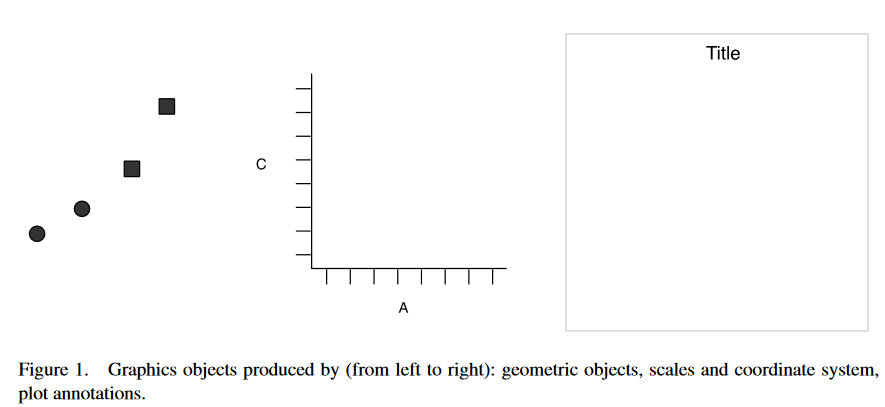
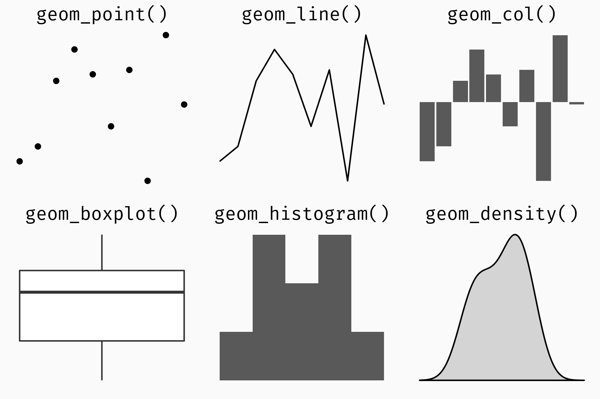
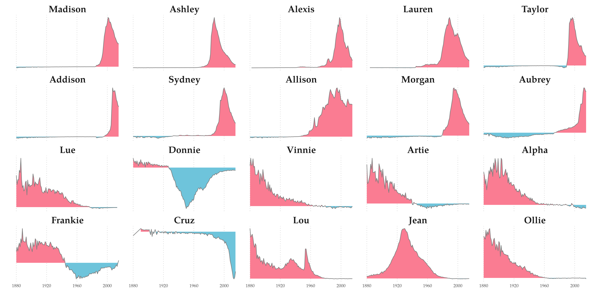

```{r setup, include=FALSE}
knitr::opts_chunk$set(echo = TRUE, cache = TRUE,
                      fig.width=6, fig.height=3)
library(tidyverse)
```

# Outline

.large[
- How can we represent data, organised?
- What is `ggplot2`?
- What parts does a plot have?
- How can we create a "publication-ready" chart?
]

---
class: inverse, center, middle

# Pipes & Data Representation

---

# Piping Operator

The pipe operator `%>%` takes the left-hand side (LHS) and "pipes" it as the first argument into the right-hand side (RHS)

--

.pull-left[
This ...
```{r, eval=F}
f(x)
```
]
.pull-right[
becomes ...
```{r, eval=F}
x %>% f()
```
]
--
<div>
.pull-left[
```{r, eval=F}
f(g(x))
```
]
.pull-right[
```{r, eval=F}
x %>% g() %>% f()
```
]

Read: take `x` **then** apply function `g()` **then** apply function `f()`

</div>
--
<div>
.pull-left[
```{r, eval=F}
filter(data, variable > 10)
```
]
.pull-right[
```{r, eval=F}
data %>% filter(variable > 10)
```
]
</div>
--
<div>
.pull-left[
```{r,eval=F}
filtered_data <- filter(data, variable > 10)
arrange(grouped_data, variable)
```
]
.pull-right[
```{r,eval=F}
data %>% 
  filter(variable > 10) %>% 
  arrange(variable)
```
]
</div>

See also: https://r4ds.had.co.nz/pipes.html

---
# Data Orientation

```{r col_table, echo=FALSE, warning=FALSE}
cols <- scales::brewer_pal(type = "qual", "Set1")(4)[c(3, 2, 1, 4)]
# remotes::install_github("DavZim/colorTable")
library(colorTable)
df <- data_frame(Year = 2010:2011,
                 DE = c(105, 110),
                 FR = c(100, 97),
                 UK = c(90, 95))
df_long <- df %>% gather(key = "Country", value = "POP", -Year)
```

.pull-left[
<h3><center>Wide</center></h3>
```{r,echo=F, results="asis", dependson="col_table"}
color_table(df, body_bg = cols[1], header_bg = cols[2])
```
]
.pull-right[
<h3><center>Long</center></h3>
```{r,echo=F, results="asis", dependson="col_table"}
color_table(df_long, body_bg = cols[1], header_bg = cols[2])
```
]
---
# Data Orientation
```{r cols_both, echo=FALSE, warning=FALSE, dependson="col_table"}
colors_wide <- matrix(c(
  cols[2], rep(cols[1], 3), cols[3], rep(cols[4], 3), cols[3], rep(cols[4], 3)
), byrow = T, nrow = 3)
colors_long <- matrix(c(
  rep(cols[2], 3), 
  rep(c(cols[3], cols[1], cols[4]), 6)
), byrow = T, ncol = 3)
```
.pull-left[
<h3><center>Wide</center></h3>
```{r, echo=FALSE, results="asis", dependson="cols_both"}
color_table(df, colors_wide)
```
]
.pull-right[
<h3><center>Long</center></h3>
```{r, echo=FALSE, results="asis", dependson="cols_both"}
color_table(df_long, colors_long)
```
]
---
# Tidy Data

> Tidy datasets are all alike, but every messy dataset is messy in its own way.

.src[.large[Hadley Wickham]]

In tidy data we have:

- One variable per column
- One observation per row
- One value per cell

--

.center[]
.src[[R4DS Tidy Data](https://r4ds.had.co.nz/tidy-data.html)]

---
# Data Transformation in the Tidyverse
.pull-left[
```{r tidy_data, dependson="libs"}
wide <- tibble(
  year = c(2002, 2007),
  Germany = c(78.7, 79.4),
  France = c(79.6, 80.7)
)
```
]
.pull-right[
```{r, echo=FALSE}
wide
```
]
--
<div>
.pull-left[
**Wide to Long**: `tidyr::pivot_longer()`
```{r pivot_longer, dependson="tidy_data"}
(long <- wide %>% 
   pivot_longer(-year,
                names_to = "country",
                values_to = "lifeExp"))
```
]
.pull-right[
**Long to Wide**: `tidyr::pivot_wider()`
```{r to_tidy, dependson="pivot_longer"}
(wide2 <- long %>% 
   pivot_wider(names_from = country, 
               values_from = lifeExp))
```
]
</div>

---
# Pivot Functions

.center[]
.src[[tidyexplain (batpigandme fork)](https://github.com/batpigandme/tidyexplain/blob/pivot/images/tidyr-longer-wider.gif)]
---

# Libraries and Dataset

Main **Packages** for today
```{r libs, message=FALSE,warning=FALSE}
library(tidyverse) # includes ggplot2, dplyr, ...
library(gapminder) # for the dataset
```

--

**Data** for today
.pull-left[
```{r, eval=F}
gapminder
```
```{r, dependson="libs",echo=F}
gapminder %>% print(n = 6, width = 50)
```
]
.pull-right[
```{r, eval=F}
glimpse(gapminder)
```
```{r, dependson="libs", echo=F}
glimpse(gapminder, width = 50)
```
]
---
class: inverse, center, middle

# ggplot2

---

# ggplot2

> You provide the data, tell ggplot2 how to map variables to aesthetics, what graphical primitives to use, and it takes care of the details.

.src[[ggplot2 documentation](https://ggplot2.tidyverse.org/)]
--

**`ggplot2`**

.pull-left[
- opiniated R-package/ecosystem allowing for a high level of abstraction
- follows the **grammer of graphics** by Leland Wilkinson (hence the `gg`)
- allows for very fast prototyping but is still highly customizable
- can do everything `base::plot()` and `lattice` can do
- provides a highly consistent API
]
.pull-right[
.center[]
]
.src[[Hadley 2010](https://byrneslab.net/classes/biol607/readings/wickham_layered-grammar.pdf)]

---

# Elements of a ggplot

.large[
- **Data** to be visualised
- **.hlb[Aes]thetic** mappings from data to plot
- **.hlb[Geom]etric** objects to be displayed
- **.hlb[Stat]istic** transformations of the data
- **.hlb[Coord]inates** organize representation of data 
- **.hlb[Scale]s** define and change aesthetics 
- **.hlb[Facet]s** create subplots
- **.hlb[Theme] / guide** fine-tune the plot
]

---
# Building a ggplot2

.left-column[
- **<mark>Data</mark>**
]
.right-column[
```{r plot_data, dependson="libs", eval=F}
ggplot(gapminder)
```

What data do we want to plot?

Data needs to be in the long/tidy format:

- One variable per column
- One observation per row
- One value per cell
]
.plot[
```{r plot_data_plot, ref.label="plot_data",echo=F}
```
]
---
# Mapping Variables
.left-column[
- Data
- **<mark>.hlb[Aes]thetics</mark>**
]
.right-column[
```{r,eval=F}
ggplot(gapminder, `aes(x = year, y = lifeExp)`)
```
```{r plot_x,eval=F,echo=F}
ggplot(gapminder, aes(x = year, y = lifeExp))
```

How do the variables of the data map to the plot? 

- `year` -> **x**
- `lifeExp` -> **y**

.small[
Additional aesthetics (depending on geometric) include (see also [specs](https://ggplot2.tidyverse.org/articles/ggplot2-specs.html)):

- color, fill, size, shape, alpha, linetype, stroke, group
]]
.plot[
```{r plot_x_plot,ref.label="plot_x",echo=F}
```
]
---
# Adding Geometrics
.left-column[
- Data
- .hlb[Aes]thetics
- **<mark>.hlb[Geom]etrics</mark>**
]
.right-column[
```{r,eval=F}
ggplot(gapminder, aes(x = year, y = lifeExp)) + 
  geom_point() #<<
```
```{r plot_geom_point,eval=F,echo=F}
ggplot(gapminder, aes(x = year, y = lifeExp)) +
  geom_point()
```
How is the data visually presented by geometric objects?
]
.plot[
```{r plot_geom_point_plot,ref.label="plot_geom_point",echo=F}
```
]
---
# Adding Geometrics
.left-column[
- Data
- .hlb[Aes]thetics
- **<mark>.hlb[Geom]etrics</mark>**
]
.right-column[
```{r,eval=F}
ggplot(gapminder, aes(x = year, y = lifeExp, `group = year`)) + 
  geom_boxplot() #<<
```
```{r plot_geom_boxplot,eval=F,echo=F}
ggplot(gapminder, aes(x = year, y = lifeExp, group = year)) +
  geom_boxplot()
```
Using different geometrics:



Full list of geometrics:
[ggplot2 documentation](https://ggplot2.tidyverse.org/reference/)
]
.plot[
```{r plot_geom_boxplot_plot,ref.label="plot_geom_boxplot",echo=F}
```
]
---
# Geometrics
.left-column[
- Data
- .hlb[Aes]thetics
- **<mark>.hlb[Geom]etrics</mark>**
]
.right-column[
.pull-left[
`geom_text()`, similar to `geom_label()`
.small[
```{r,eval=F}
# choose only a subste of the data
gapminder %>%
  filter(year == 2007, 
         country %in% c("Germany", "France")) %>%
  # the actual plot
  ggplot(aes(`x = lifeExp, y = gdpPercap,` 
             `label = country`)) +
  geom_point(color = "red") +
  geom_text() #<<
```
]

```{r geom_text,echo=F}
gapminder %>%
  filter(year == 2007, 
         country %in% c("Germany", "France")) %>% 
  ggplot(aes(x = lifeExp, y = gdpPercap,
             label = country)) +
  geom_point(color = "red") +
  geom_text()
```

]
.pull-right[
`geom_density()`, similar to `geom_histogram()` and `geom_violin()`
.small[
```{r geom_density_code, eval=F}
# choose only a subset of the data
gapminder %>% 
  filter(year == 2007) %>% 
  # the actual plot
  ggplot(aes(`x = gdpPercap`, fill = continent)) +
  geom_density(alpha = 0.5) #<<
```
```{r geom_density, echo=F}
gapminder %>% 
  filter(year == 2007) %>% 
  ggplot(aes(x = gdpPercap, fill = continent)) +
  geom_density(alpha = 0.5)
```
]]]

---
# Geometrics
.left-column[
- Data
- .hlb[Aes]thetics
- **<mark>.hlb[Geom]etrics</mark>**
]

```{r}
lsf.str("package:ggplot2") %>% grep("^geom_", ., value = TRUE)
```

---
# Recap Aesthetics and Geometrics
```{r data_diamonds, dependson="libs",echo=F}
set.seed(123)
data <- diamonds %>% sample_n(20)
add_dots <- function(d) {
  bind_rows(d %>% mutate_all(as.character),
            d %>% slice(1) %>% mutate_all(function(x) "..."))
}
data_table <- data %>% 
  slice(1:3) %>% 
  select(carat, price, cut, table) %>% 
  add_dots() %>% 
  knitr::kable() %>% 
  kableExtra::kable_styling()
```

.left-column[
**Data**

`data`
.small[
```{r, echo=F, dependson="data_diamonds"}
data_table
```
]

**.hlb[Aes]thetic Mappings**
$$\emptyset$$

**.hlb[Geom]etric**
$$\emptyset$$

]

.right-column[
```{r, dependson="data_diamonds", fig.width=7, fig.height=5}
ggplot(data) #<<
```
]

---

# Recap Aesthetics and Geometrics
.left-column[
**Data**

`data`
.small[
```{r, echo=F, dependson="data_diamonds"}
data_table
```
]

**.hlb[Aes]thetic Mappings**
- `carat` -> **x**

**.hlb[Geom]etric**
$$\emptyset$$

]

.right-column[
```{r,eval=F}
ggplot(data, `aes(x = carat)`)
```
```{r, dependson="data_diamonds", fig.width=7, fig.height=5,echo=F}
ggplot(data, aes(x = carat))
```
]

---

# Recap Aesthetics and Geometrics
.left-column[
**Data**

`data`
.small[
```{r, echo=F, dependson="data_diamonds"}
data_table
```
]

**.hlb[Aes]thetic Mappings**
- `carat` -> **x**
- `price` -> **y**

**.hlb[Geom]etric**
$$\emptyset$$

]

.right-column[
```{r,eval=F}
ggplot(data, aes(x = carat, `y = price`))
```
```{r, dependson="data_diamonds", fig.width=7, fig.height=5,echo=F}
ggplot(data, aes(x = carat, y = price))
```
]

---

# Recap Aesthetics and Geometrics
.left-column[
**Data**

`data`
.small[
```{r, echo=F, dependson="data_diamonds"}
data_table
```
]

**.hlb[Aes]thetic Mappings**
- `carat` -> **x**
- `price` -> **y**

**.hlb[Geom]etric**

`geom_point()`
]

.right-column[
```{r,eval=F}
ggplot(data, aes(x = carat, y = price)) +
  geom_point() #<<
```
```{r, dependson="data_diamonds", fig.width=7, fig.height=5, echo=F}
ggplot(data, aes(x = carat, y = price)) +
  geom_point()
```
]

---

# Recap Aesthetics and Geometrics
.left-column[
**Data**

`data`
.small[
```{r, echo=F, dependson="data_diamonds"}
data_table
```
]

**.hlb[Aes]thetic Mappings**
- `carat` -> **x**
- `price` -> **y**
- `cut` -> **color**

**.hlb[Geom]etric**

`geom_point()`
]

.right-column[
```{r,eval=F}
ggplot(data, aes(x = carat, y = price, `color = cut`)) +
  geom_point()
```
```{r, dependson="data_diamonds", fig.width=7, fig.height=5, warning=F, echo=F}
ggplot(data, aes(x = carat, y = price, color = cut)) +
  geom_point()
```
]

---

# Interlude: Assigning, Adding and Saving

A `ggplot` object behaves like any `R` object and can bve assigned:
```{r assign, dependson="data_diamonds"}
myplot <- ggplot(data, aes(x = carat, y = price, size = price)) + 
  geom_point()
```

--
.pull-left[
Adding to a plot can be done using the `+` operator like in all `ggplot`-calls:
```{r adds, dependson="data_diamonds"}
myplot + 
  labs(title = "Diamond Prices")
```
]
--
.pull-right[
Saving a plot can be done using:
```{r, eval=F}
ggsave("myplot.pdf", myplot, width = 7, height = 5)
ggsave("myplot.png", myplot, width = 7, height = 5, 
       dpi = 300)
```
]

---
# Statistical Transformations
.left-column[
- Data
- .hlb[Aes]thetics
- .hlb[Geom]etrics
- **<mark>.hlb[Stat]istics</mark>**
]
.right-column[
.pull-left[

Some geometrics apply data transformations (internal `stat` functions) such as `geom_histogram()` or `geom_bar()`.

```{r hist_data}
ggplot(gapminder, aes(x = continent)) +
  geom_bar()
```
]
.pull-right[
To disable the statistical calculations, we can use `stat = "identity"` or use `geom_col()`.
```{r, eval=F}
gapminder %>% 
  count(continent) %>% 
  ggplot(aes(x = continent, y = n)) +
  geom_bar(`stat = "identity"`)
```
```{r geom_bar, echo=F}
gapminder %>% 
  count(continent) %>% 
  ggplot(aes(x = continent, y = n)) +
  geom_bar(stat = "identity")
```
]
]

---
# Coordinates
.left-column[
- Data
- .hlb[Aes]thetics
- .hlb[Geom]etrics
- .hlb[Stat]istics
- **<mark>.hlb[Coord]inates</mark>**
]
.right-column[
Create a base plot
```{r coord_plot}
base_plot <- ggplot(gapminder %>% filter(year == 2007),
                 aes(x = lifeExp, y = gdpPercap, color = continent)) +
  geom_point()
```

Manipulate the coordinate system, see also `coord_map()` and `coord_polar()`

.pull-left[
```{r coord_flip, dependson="coord_plot"}
base_plot +
  coord_flip() #<<
```
]
.pull-right[
```{r coord_fixed, dependson="coord_plot"}
base_plot +
  coord_fixed(ratio = 1/1000) #<<
```
]
]

---
# Scales
.left-column[
- Data
- .hlb[Aes]thetics
- .hlb[Geom]etrics
- .hlb[Stat]istics
- .hlb[Coord]inates
- **<mark>.hlb[Scale]s</mark>**
]
.right-column[
Manipulate Axis
.pull-left[
```{r scale_10, dependson="coord_plot"}
base_plot +
  scale_y_log10(name = "Log 10 GDPpC") #<<
```
]
.pull-right[
```{r scale_rev, dependson="coord_plot"}
base_plot +
  scale_x_reverse() #<<
```
]

Use `labs(x = "X-Axis Name", y = "Y-Axis Name", title = "Plot Title", ...)` to set multiple labels.
]

---
# Scales
.left-column[
- Data
- .hlb[Aes]thetics
- .hlb[Geom]etrics
- .hlb[Stat]istics
- .hlb[Coord]inates
- **<mark>.hlb[Scale]s</mark>**
]
.right-column[
Format Axis using the `scales` library
```{r scales_lib, warning=F, message=F}
library(scales)
```

.pull-left[
```{r scale_dollar1, eval=F}
base_plot +
  scale_y_continuous(`labels = dollar`)
```
```{r scale_dollar, dependson=c("scales_lib", "coord_plot"),echo=F}
base_plot +
  scale_y_continuous(labels = scales::dollar)
```
]
.pull-right[
```{r scale_comma1, eval=F}
base_plot +
  scale_y_continuous(`labels = comma`)
```
```{r scale_comma, echo=F,dependson=c("scales_lib", "coord_plot")}
base_plot +
  scale_y_continuous(labels = scales::comma)
```
]
]

---
# Interlude Colors

Colors and fill-colors can be mapped using aesthetics or directly assigned
.pull-left[
```{r color1,eval=F}
ggplot(gapminder, aes(x = lifeExp, y = gdpPercap,
                      `color = continent`)) +
  geom_point()
```
```{r color1a,echo=F}
ggplot(gapminder, aes(x = lifeExp, y = gdpPercap, 
                      color = continent)) +
  geom_point()
```

]

.pull-right[
```{r color2, eval=F}
ggplot(gapminder, aes(x = lifeExp, y = gdpPercap)) +
  geom_point(`color = "red"`)
```
```{r color2a, echo=F}
ggplot(gapminder, aes(x = lifeExp, y = gdpPercap)) +
  geom_point(color = "red")
```
]

---
# Interlude Colors

Difference between `color` and `fill` aesthetic mappings:

.pull-left[
```{r colorbar,eval=F}
ggplot(gapminder, aes(x = continent, 
                      `color` = continent)) +
  geom_bar()
```
```{r colorbara, echo=F}
ggplot(gapminder, aes(x = continent, color = continent)) +
  geom_bar()
```
]
--
.pull-right[
```{r colorfillbar,eval=F}
ggplot(gapminder, aes(x = continent, 
                      `fill` = continent)) +
  geom_bar()
```
```{r colorfillbara,echo=F}
ggplot(gapminder, aes(x = continent, fill = continent)) +
  geom_bar()
```
]

--

Use `fill` for geometrics that have an area (`geom_` `bar`, `col`, `polygon`, `ribbon`, ...).

Use `color` for geometrics that are 1-dimensional (`geom_` `line`, `point`, `path`, ...).
---

# Scales
.left-column[
- Data
- .hlb[Aes]thetics
- .hlb[Geom]etrics
- .hlb[Stat]istics
- .hlb[Coord]inates
- **<mark>.hlb[Scale]s</mark>**
]
.right-column[
Scales are also used for manipulating colors

.pull-left[
See also: http://colorbrewer2.org
```{r colors_brewer, dependson="coord_plot"}
base_plot +
  scale_color_brewer(palette = "Set1") #<<
```
]
.pull-right[
.small[
```{r colors_manual, dependson="coord_plot"}
colors <- c("Africa" = "red", "Americas" = "lightgreen", 
            "Europe" = "#dd1c77", "Asia" = "#feb24c", 
            "Oceania" = "#2b8cbe")

base_plot +
  scale_color_manual(values = colors, name = "Kontinente") #<<
```
]
]

Use `guide(color = FALSE)` to turn of the legend for a mapping.

]

---
# All Scales
.small[
```{r, eval=F}
lsf.str("package:ggplot2") %>% grep("^scale_", ., value = TRUE)
```
```{r,echo=F}
ww <- options(width = 150)
lsf.str("package:ggplot2") %>% grep("^scale_", ., value = TRUE)
options(width = ww$width)
```
]

---

# Faceting a Plot

.left-column[
- Data
- .hlb[Aes]thetics
- .hlb[Geom]etrics
- .hlb[Stat]istics
- .hlb[Coord]inates
- .hlb[Scale]s
- **<mark>.hlb[Facet]ing</mark>**
]
.right-column[
.pull-left[
```{r facet1, dependson="coord_plot"}
base_plot +
  facet_wrap(~continent) #<<
```
]
.pull-right[
```{r facet_grid1, eval=F, dependson="coord_plot"}
base_plot +
  facet_`grid`(~continent)
```
```{r facet_grid, echo=F,dependson="coord_plot"}
base_plot +
  facet_grid(~continent)
```
]
]

---

# Themes

.left-column[
- Data
- .hlb[Aes]thetics
- .hlb[Geom]etrics
- .hlb[Stat]istics
- .hlb[Coord]inates
- .hlb[Scale]s
- .hlb[Facet]ing
- **<mark>.hlb[Theme]s</mark>**
]
.right-column[
Apply a general theme for a plot with `theme_...()`. See also [ggthemes](https://jrnold.github.io/ggthemes/reference/index.html).

To set a theme for all following plots, use `theme_set(theme_light())`

.pull-left[
```{r theme1, dependson="coord_plot"}
base_plot + 
  theme_light() #<<
```

]
.pull-right[
```{r theme2, dependson="coord_plot"}
base_plot +
  theme_dark() #<<
```
]

Use `theme(...)` for tine-tuning a plot even more.
]

---
class: inverse, center, middle

# Fine-Tuning a Plot
---
# Assign Data
```{r fine_1, fig.width=16, fig.height=9, fig.show="hide",fig.retina=2}
ggplot(gapminder)
```
.src2[Based on [gadenbuie gentle-ggplot2](https://pkg.garrickadenbuie.com/gentle-ggplot2)]
.plot-callout[
`)
]
---
# Mapping Variables to Plot
```{r, eval=F}
ggplot(gapminder, `aes(x = gdpPercap, y = lifeExp, size = pop, color = country)`)
```
```{r fine_2,echo=F,fig.width=16, fig.height=9, fig.show="hide",fig.retina=2}
ggplot(gapminder, aes(x = gdpPercap, y = lifeExp, size = pop, color = country))
```
.src2[Based on [gadenbuie gentle-ggplot2](https://pkg.garrickadenbuie.com/gentle-ggplot2)]
.plot-callout[
`)
]
---
# Adding Point Geometric 
```{r fine_3, fig.width=16, fig.height=9, fig.show="hide",fig.retina=2}
ggplot(gapminder, aes(x = gdpPercap, y = lifeExp, size = pop, color = country)) +
  geom_point() #<<
```
.src2[Based on [gadenbuie gentle-ggplot2](https://pkg.garrickadenbuie.com/gentle-ggplot2)]
.plot-callout[
`)
]
---
# Removing the Legend
```{r fine_4, fig.width=16, fig.height=9, fig.show="hide",fig.retina=2}
ggplot(gapminder, aes(x = gdpPercap, y = lifeExp, size = pop, color = country)) +
  geom_point() +
  guides(color = FALSE, size = FALSE) #<<
```
.src2[Based on [gadenbuie gentle-ggplot2](https://pkg.garrickadenbuie.com/gentle-ggplot2)]
.plot-callout[
`)
]
---
# Adding Facets
```{r fine_5, fig.width=16, fig.height=9, fig.show="hide",fig.retina=2}
ggplot(gapminder, aes(x = gdpPercap, y = lifeExp, size = pop, color = country)) +
  geom_point() + 
  guides(color = FALSE, size = FALSE) +
  facet_wrap(~year) #<<
```
.src2[Based on [gadenbuie gentle-ggplot2](https://pkg.garrickadenbuie.com/gentle-ggplot2)]
.plot-callout[
`)
]
---
# Formatting the x-Axis
```{r fine_6, fig.width=16, fig.height=9, fig.show="hide",fig.retina=2}
ggplot(gapminder, aes(x = gdpPercap, y = lifeExp, size = pop, color = country)) +
  geom_point() +
  guides(color = FALSE, size = FALSE) +
  facet_wrap(~year) +
  scale_x_log10(breaks = c(10^3, 10^4, 10^5), labels = c("1k", "10k", "100k")) #<<
```
.src2[Based on [gadenbuie gentle-ggplot2](https://pkg.garrickadenbuie.com/gentle-ggplot2)]
.plot-callout[
`)
]
---
# Formatting the Colors
```{r fine_7, fig.width=16, fig.height=9, fig.show="hide",fig.retina=2}
ggplot(gapminder, aes(x = gdpPercap, y = lifeExp, size = pop, color = country)) +
  geom_point() +
  guides(color = FALSE, size = FALSE) +
  facet_wrap(~year) +
  scale_x_log10(breaks = c(10^3, 10^4, 10^5), labels = c("1k", "10k", "100k")) +
  scale_color_manual(values = gapminder::country_colors) #<<
```
.src2[Based on [gadenbuie gentle-ggplot2](https://pkg.garrickadenbuie.com/gentle-ggplot2)]
.plot-callout[
`)
]
---
# Formatting the Size Aesthetic
```{r fine_8, fig.width=16, fig.height=9, fig.show="hide",fig.retina=2}
ggplot(gapminder, aes(x = gdpPercap, y = lifeExp, size = pop, color = country)) +
  geom_point() +
  guides(color = FALSE, size = FALSE) +
  facet_wrap(~year) +
  scale_x_log10(breaks = c(10^3, 10^4, 10^5), labels = c("1k", "10k", "100k")) +
  scale_color_manual(values = gapminder::country_colors) + 
  scale_size(range = c(0.5, 12)) #<<
```
.src2[Based on [gadenbuie gentle-ggplot2](https://pkg.garrickadenbuie.com/gentle-ggplot2)]
.plot-callout[
`)
]
---
# Formatting the Labels
```{r fine_9, fig.width=16, fig.height=9, fig.show="hide",fig.retina=2}
ggplot(gapminder, aes(x = gdpPercap, y = lifeExp, size = pop, color = country)) +
  geom_point() +
  guides(color = FALSE, size = FALSE) +
  facet_wrap(~year) +
  scale_x_log10(breaks = c(10^3, 10^4, 10^5), labels = c("1k", "10k", "100k")) +
  scale_color_manual(values = gapminder::country_colors) +
  scale_size(range = c(0.5, 12)) +
  labs( #<<
    title = "A Visualisation of the Gapminder Data", #<<
    subtitle = "Based on Hans Rosling", #<<
    x = "GDP per capita", #<<
    y = "Life Expectancy" #<<
  ) #<<
```
.src2[Based on [gadenbuie gentle-ggplot2](https://pkg.garrickadenbuie.com/gentle-ggplot2)]
.plot-callout[
`)
]
---
# Formatting the Theme and Font
```{r fine_10, fig.width=16, fig.height=9, fig.show="hide",fig.retina=2}
ggplot(gapminder, aes(x = gdpPercap, y = lifeExp, size = pop, color = country)) +
  geom_point() +
  guides(color = FALSE, size = FALSE) +
  facet_wrap(~year) +
  scale_x_log10(breaks = c(10^3, 10^4, 10^5), labels = c("1k", "10k", "100k")) +
  scale_color_manual(values = gapminder::country_colors) +
  scale_size(range = c(0.5, 12)) +
  labs(
    title = "A Visualisation of the Gapminder Data",
    subtitle = "Based on Hans Rosling",
    x = "GDP per capita",
    y = "Life Expectancy"
  ) +
  theme_minimal(base_family = "Fira Sans") #<<
```
.src2[Based on [gadenbuie gentle-ggplot2](https://pkg.garrickadenbuie.com/gentle-ggplot2)]
.plot-callout[
`)
]
---
# Formatting the Panel Elements
```{r fine_11, fig.width=16, fig.height=9, fig.show="hide",fig.retina=2}
ggplot(gapminder, aes(x = gdpPercap, y = lifeExp, size = pop, color = country)) +
  geom_point() +
  guides(color = FALSE, size = FALSE) +
  facet_wrap(~year) +
  scale_x_log10(breaks = c(10^3, 10^4, 10^5), labels = c("1k", "10k", "100k")) +
  scale_color_manual(values = gapminder::country_colors) +
  scale_size(range = c(0.5, 12)) +
  labs(
    title = "A Visualisation of the Gapminder Data",
    subtitle = "Based on Hans Rosling",
    x = "GDP per capita",
    y = "Life Expectancy"
  ) +
  theme_minimal(base_family = "Fira Sans") +
  theme( #<<
    strip.text = element_text(size = 16, face = "bold"), #<<
    panel.border = element_rect(fill = NA, #<< 
                                color = "grey40"), #<<
    panel.grid.minor = element_blank() #<<
  ) #<<
```
.src2[Based on [gadenbuie gentle-ggplot2](https://pkg.garrickadenbuie.com/gentle-ggplot2)]
.plot-callout[
`)
]
---

# Initial Plot

.center[]

---

# Final Plot

.center[]

---
class: inverse, center, middle

# Bonus Material

See also: [ggplot2 extensions](http://www.ggplot2-exts.org/gallery/)

---
# Bonus: cowplot
.pull-left[
[cowplot](https://github.com/wilkelab/cowplot) allows us to:

- combine and align multiple plots
- creating inset plots (drawing plots on plots)
- annotate plots with images

See also the [vignettes](https://wilkelab.org/cowplot/articles/index.html) of the package.

.src2[clauswilke & [cowplot](https://github.com/wilkelab/cowplot)]
]
.pull-right[.small[
```{r cow, warning=F,message=F, fig.height=5}
library(cowplot)
mid <- function(x) mean(range(x))
p1 <- ggplot(mtcars, aes(disp, mpg)) + geom_point()
p2 <- ggplot(mtcars, aes(disp, hp)) + 
  draw_label("Draft", x = mid(mtcars$disp), y = mid(mtcars$hp), #<<
             color = "#C0A0A0", size = 70, angle = 45) + #<<
  geom_point()

plot_grid(p1, p2, ncol = 1, align = "v") #<<
```
]]
---
# Bonus: Repelling Labels
Non-overlapping text and labels using [`ggrepel`](https://github.com/slowkow/ggrepel)
```{r repel_data, warning=F, message=F}
library(ggrepel)
cars <- mtcars %>% rownames_to_column("car") %>% slice(1:20)
```

.pull-left[
```{r repel_init, dependson="repel_data"}
ggplot(cars, aes(wt, mpg, label = car)) +
  geom_text() +
  geom_point(color = "red")
```
]
--
.pull-right[
```{r repel_repel,dependson="repel_data"}
ggplot(cars, aes(wt, mpg, label = car)) +
  geom_text_repel() + #<<
  geom_point(color = "red")
```
]

.src2[slowkow & [ggrepel](https://github.com/slowkow/ggrepel)]

---
# Bonus: Map
```{r map, warning=F, message=F}
library(sf)
# download and extract data 1stellig.shp.zip
# https://www.suche-postleitzahl.org/downloads 
map <- read_sf("plz-1stellig.shp")
```
```{r map_plot1, dependson="map",fig.width=16,fig.height=9,eval=F}
ggplot(map) +
  geom_sf(aes(fill = plz)) + #<<
  scale_fill_viridis_d(name = "PLZ") +
  theme_minimal(base_family = "Roboto Condensed") +
  labs(title = "German Postleitzahl (PLZ)",
       caption = "Source: www.suche-postleitzahl.org")
```
.src2[[https://www.suche-postleitzahl.org/downloads](https://www.suche-postleitzahl.org/downloads)]

.plot[
```{r map_plot1_plot,echo=F, ref.label="map_plot1"}
```

]

---
# Bonus: Ridge Charts
.pull-left[
```{r ggridges, dependson="libs", warning=F, message=F}
library(ggridges)

variables <- c("Month", "Mean Temperature [F]")
linc <- lincoln_weather %>%
  select_at(variables) %>% 
  set_names(c("month", "mean_temp")) %>% 
  mutate(mean_temp = (mean_temp - 32) * 5 / 9)
```
]
.pull-right[
```{r, eval=F}
glimpse(linc)
```
```{r gl_linc, dependson="ggridges",echo=F}
glimpse(linc, width=50)
```
]

```{r ridges, eval=F,dependson="ggridges"}
ggplot(linc, aes(x = mean_temp, y = month, fill = ..x..)) +
  geom_density_ridges_gradient(scale = 3, rel_min_height = 0.01) + #<<
  scale_fill_viridis_c() +
  labs(title = "Mean Temperature in Lincoln, NB 2016",
       y = "Month", x = "Mean Temperature °C", fill = "°C") +
  theme_minimal()
```
.src2[Wilke & [ggridges](https://cran.rstudio.com/web/packages/ggridges/vignettes/introduction.html)]
.plot[
```{r ridges_plot, echo=F, ref.label="ridges",message=F,warning=F}
```
]

---
# Bonus: Alluvial Charts

.pull-left[
```{r alluvial, warning=F, message=F}
library(ggalluvial)
titanic <- Titanic %>% as_tibble()
```
]
.pull-right[
```{r, eval=F}
glimpse(titanic)
```
```{r alluvial_data, echo=F}
glimpse(titanic, width = 40)
```
]
```{r alluvial_plot, dependson="alluvial", eval=F, fig.retina=2}
ggplot(data = titanic, aes(axis1 = Class, axis2 = Sex, axis3 = Age, y = n)) +
  geom_alluvium(aes(fill = Survived)) + # Flows #<<
  geom_stratum() + # Boxes #<<
  geom_text(stat = "stratum", label.strata = TRUE) + #<<
  scale_x_discrete(limits = c("Class", "Sex", "Age"),
                   expand = c(.1, .05)) +
  labs(x = "Demographic", y = "N", title = "Passengers of the Titanic", 
       subtitle = "Stratified by Demographics and Survival") +
  theme_minimal(base_family = "Roboto Condensed") +
  scale_fill_brewer(palette = "Set1")
```
.src2[corybrunson & [ggalluvial](https://github.com/corybrunson/ggalluvial)]
.plot[
```{r alluvial_plot_plot, ref.label="alluvial_plot", echo=F}
```
]

---
# Bonus: Network Graphs
.pull-left[
```{r network, message=F,warning=F}
library(tidygraph)
library(ggraph)

graph <- as_tbl_graph(highschool) %>% 
    mutate(
      Popularity = centrality_degree(mode = 'in')
    )
```

A graph-object (similar to `igraph`) stores the nodes (i.e., dots) and edges (the connections) separately.

- `tidygraph` is used for manipulating a graph-object, akin to `dplyr`
- `ggraph` is used for visualising the graph, akin to `ggplot2`

See also [this](https://www.data-imaginist.com/2017/ggraph-introduction-layouts/), [this](https://www.data-imaginist.com/2017/ggraph-introduction-nodes/), and [this](https://www.data-imaginist.com/2017/ggraph-introduction-edges/).
]
.pull-right[.small[
```{r}
graph
```
]]

.src2[Pedersen, [tidygraph](https://github.com/thomasp85/tidygraph), & [ggraph](https://github.com/thomasp85/ggraph)]

---
# Bonus: Network Graphs continued

Using `ggraph` to visualise the network
```{r network_plot, eval=F, dependson="network"}
ggraph(graph, layout = "kk") + #<<
  geom_edge_fan(aes(alpha = stat(index)), show.legend = FALSE) + #<<
  geom_node_point(aes(size = Popularity)) + #<<
  facet_edges(~year) + 
  theme_graph(foreground = "steelblue", fg_text_colour = "white") +
  labs(title = "Highschool Network of Friends")
```

.src2[Pedersen, [tidygraph](https://github.com/thomasp85/tidygraph), & [ggraph](https://github.com/thomasp85/ggraph)]

.plot[
```{r network_plot_plot, echo=F, ref.label="network_plot"}
```
]

---
# Bonus: Waffle Charts
.pull-left[
```{r waffle, warning=F, message=F}
# devtools::install_github("hrbrmstr/waffle")
library(waffle)

storms <- dplyr::storms %>% 
  filter(year >= 2010) %>% 
  count(year, status)
```
]
.pull-right[
```{r, eval=F}
glimpse(storms)
```
```{r, dependson="waffle", echo=F}
glimpse(storms, width = 50)
```
]

```{r waffle_plot, dependson="waffle", eval=F}
ggplot(storms, aes(fill = status, values = n)) +
  geom_waffle(color = "white", size = .25, n_rows = 10, flip = TRUE) + #<<
  facet_wrap(~year, nrow = 1, strip.position = "bottom") +
  scale_x_discrete() + 
  scale_fill_brewer(palette = "Set1", name = NULL) +
  coord_equal() +
  labs(title = "Faceted Waffle Bar Chart", 
       subtitle = "{dplyr} storms data", x = "Year", y = "Count") +
  theme_minimal(base_family = "Roboto Condensed") +
  theme(panel.grid = element_blank(), axis.ticks.y = element_line())
```

.src2[hrbrmstr & [waffle](https://github.com/hrbrmstr/waffle)]

.plot[
```{r waffe_plot_plot, ref.label="waffle_plot", echo=F}
```
]

---
# Bonus: Statistical Plots
.pull-left[
```{r statplot, warning=F,message=F,eval=F}
library(ggstatsplot)
glimpse(movies_long)
```
Warning, `install.packages("ggstatsplot")` might take a while (heavy on dependencies).

See also [ggstatsplot documentation](https://indrajeetpatil.github.io/ggstatsplot/)
]
.pull-right[
.small[
```{r statplot_out, echo=F,warning=F,message=F,ref.label="statplot"}
```
]
]

<div>
.pull-left[
```{r statplot_plot, dependson="statplot", eval=F}
ggbetweenstats(
  data = movies_long,
  x = mpaa,
  y = rating,
  pairwise.comparisons = TRUE,
  pairwise.display = "s",
  messages = FALSE
)
```
]
.pull-left[
```{r statplot_plot_out, echo=F,ref.label="statplot_plot", fig.width=7, fig.height=5}
```
]
</div>

---

# Bonus: Animation

.small[
```{r gganimate, dependson="libs", warning=F, message=F}
library(gifski)
library(gganimate)

plot <- ggplot(gapminder, aes(gdpPercap, lifeExp, size = pop, colour = country)) +
  geom_point(alpha = 0.7, show.legend = FALSE) +
  scale_colour_manual(values = country_colors) +
  scale_size(range = c(2, 12)) +
  scale_x_log10() +
  facet_wrap(~continent) +
  labs(x = "GDP per capita", y = "Life Expectancy") +
  theme_light()
```
]

.src2[Pedersen & [gganimate](https://github.com/thomasp85/gganimate)]

.pull-left[.small[
```{r anim_static, dependson="gganimate"}
plot
```
]]
--
.pull-right[.small[
```{r anim, dependson="gganimate",message=FALSE,warning=FALSE,eval=F}
plot +
  labs(title = "Year: {frame_time}") +
  transition_time(year) + #<<
  ease_aes("linear") #<<
```
]]
--
.plotleft[
```{r anim_plotleft, echo=F,ref.label="anim", fig.retina=TRUE,fig.height=6,fig.width=8.2}
```
]

---
class: inverse, middle, center

# Thanks for listening!

---

# Exercises

Throughout all exercises, make sure to label the axis and other elements properly.

Also use colors where needed to highlight certain aspects.

1. Use the `mtcars` dataset and explore the relation of `mpg` (miles per gallon), `hp` (horsepower) and `cyl` (cylinders), look at `geom_smooth()`. 
2. Use `starwars` to look at the distribution of species using `geom_box()` and `geom_col()`.
3. Use the `gapminders` dataset and look at the histogram and densities of different continents over different years, try also `geom_boxplot()`.
4. Use the `reshape::tips` dataset to look at the effects of the gender and weekdays on tipping using facets. 
5. Recreate the following plot using `babynames::babynames`:

.pull-left[
.center[]
]
.pull-right[
.src2[[gadenbuie](https://pkg.garrickadenbuie.com/trug-ggplot2/index_files/figure-html/genben-plot-out-1.png)]
]

---

# Exercises Advanced

Pick and explore one of the following datasets using the skills you learned today:

If you have a github account, use `reprex` and github gists to share the code and results with us!

- Panel: `gapminder::gapminder`, `dplyr::storms`
- Map / Spatial: `ggmap::crime`, `dplyr::storms`, `nycflights13::flights` (you can also try the `leaflet` package)
- Longitudinal: `babynames::babynames`, `nycflights13::flights`
- Network: `ggraph::whigs`, `ggraph::highschool`
- Dataset collection: https://github.com/rfordatascience/tidytuesday

Create your own "corporate" colors that you can apply to your charts [(starter)](i.e., https://drsimonj.svbtle.com/creating-corporate-colour-palettes-for-ggplot2).

Look at the [extensions gallery](http://www.ggplot2-exts.org/gallery/) use and experiment with some extensions

---

# Further Resources

Learn More

- Documentation: http://ggplot2.tidyverse.org/
- R for Data Science: http://r4ds.had.co.nz/data-visualisation.html
- ggplot CheatSheet https://rstudio.com/wp-content/uploads/2015/03/ggplot2-cheatsheet.pdf

Other ggplot2 workshops:

- Garrick Aden-Buie: https://pkg.garrickadenbuie.com/gentle-ggplot2/
